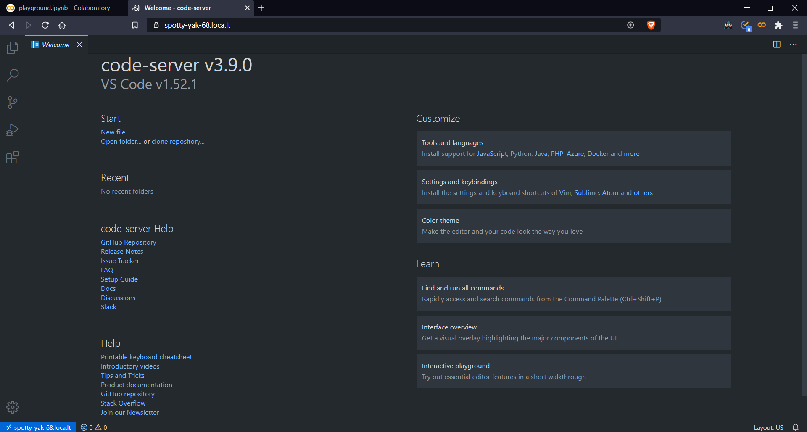
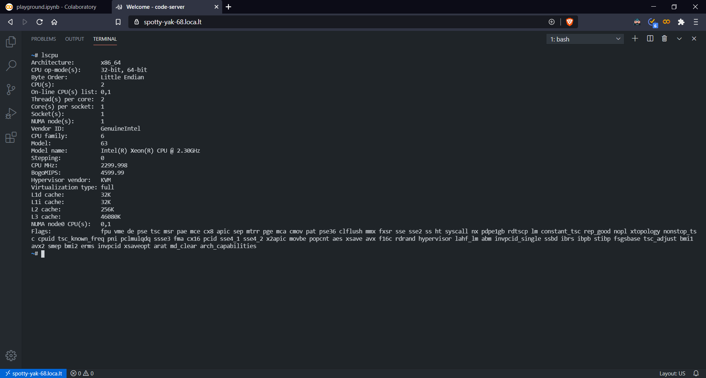
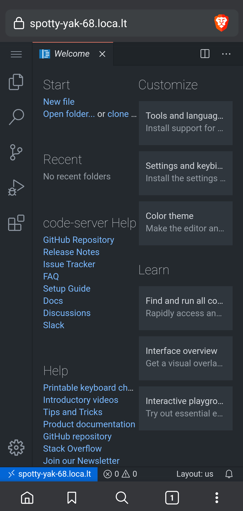
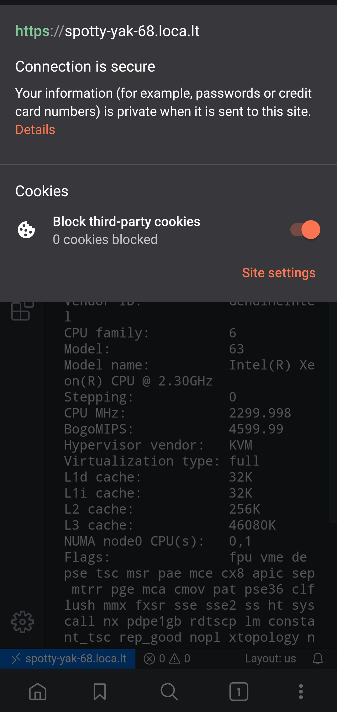
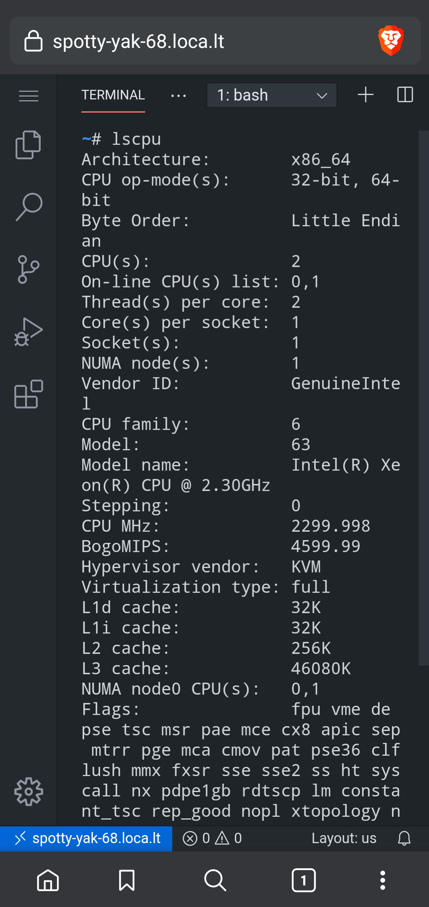
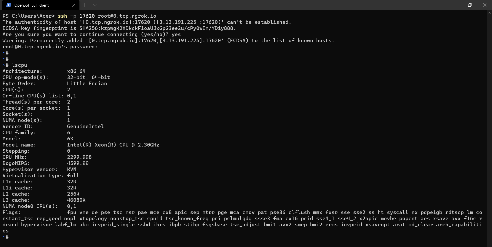
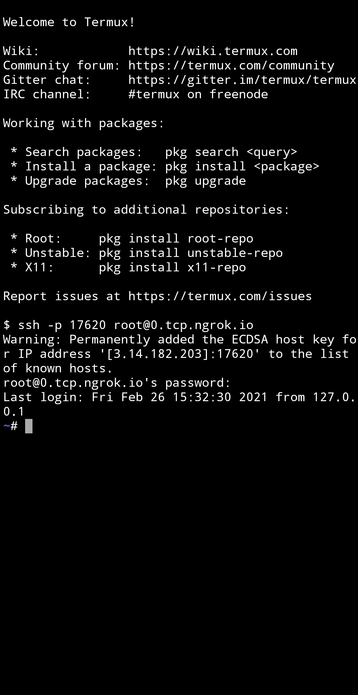
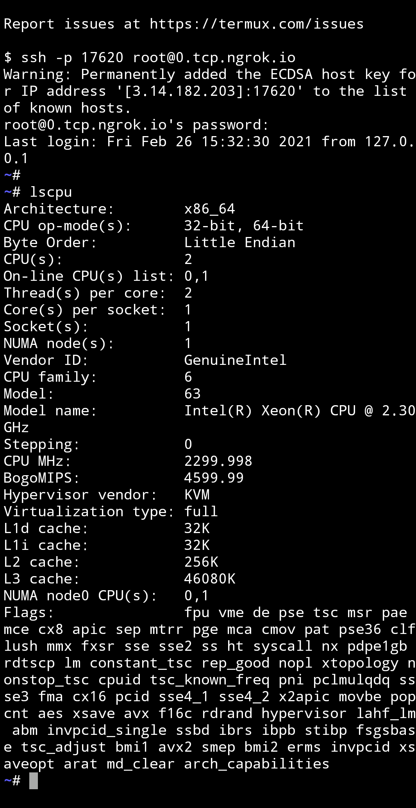
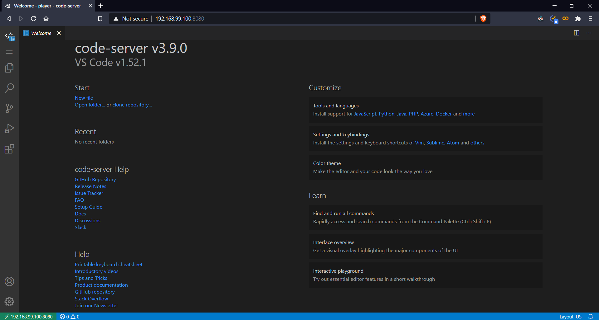
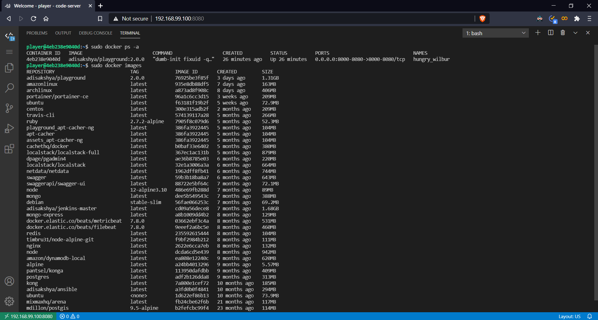

# Remote Playground

[](https://colab.research.google.com/github/adisakshya/playground/blob/master/remote/playground.ipynb)

- A remote development environment powered by Google Colab.
- Take advantage of Google Cloud servers to speed up builds, tests, compilation and more.
- Code from any device using browser or SSH.
- All intensive computations runs on Google Cloud server.
- Preserve battery life when you're on the go.
- Perform quick experiments or prototype something.

## Prerequisites

- Make sure you have a google account.
- **For SSH access only:** an [ngrok](https://dashboard.ngrok.com/signup) account. The notebook prompts for an authtoken, which you copy from your ngrok dashboard. Not required if you only use the Web IDE.

## Getting Started

The ```playground.ipynb``` sets up the development environment which can be accessed in the following two ways:

1. Web IDE
    1. [code-server](https://github.com/coder/code-server) is used to provided an efficient and securely accessible Web IDE in the colab development environment.
    2. Secure HTTPs is included when exposing code-server to the internet.
    3. The URL to the Web IDE is generated during execution of the colab-notebook and can be different everytime the notebook is executed.

2. Terminal based system with SSH access
    1. The SSH connect command is generated during execution of the colab-notebook.
    2. Hostname can be different everytime the notebook is executed.

## Remote Playground In Action

Code from your laptop, PC, chromebook, tablet and mobile with a consistent development environment.

#### Web IDE

1. Access from laptop/desktop

Welcome Screen             | CPU Architecture Information
:-------------------------:|:--------------------------:
   | 


2. Access from mobile

Welcome Screen             | Secure HTTPs               |  CPU Architecture Information
:-------------------------:|:--------------------------:|:------------------:
   |   | 


---

#### SSH Access

1. Access from laptop/desktop

SSH Connection             |
:-------------------------:|


2. Access from Mobile using [Termux](https://play.google.com/store/apps/details?id=com.termux&hl=en_IN&gl=US)

SSH Connection             | CPU Architecture Information          
:-------------------------:|:--------------------------:
   | 

# Local Playground

[](https://travis-ci.com/adisakshya/playground)

- Setup your minimal customized local development environment.
- Preserve battery life when you're on the go.

## Getting Started

There are two ways to setup the local development environment which can be accessed using a Web IDE:

- Using the install script which automates the setup process.
    1. Install scripts are included for the following platforms:
        - Debian and Windows (WSL)
            ```
            curl -fsSL https://raw.githubusercontent.com/adisakshya/playground/master/local/shell/debian.sh | bash
            ```
        - Amazon-Linux
            ```
            curl -fsSL https://raw.githubusercontent.com/adisakshya/playground/master/local/shell/amazon-linux.sh | bash
            ```
    2. Feel free to contribute an install script for any other platform like CentOS, MacOS, Arch Linux etc, that would setup the local development environment in a single command.
- Using Docker [make sure you have docker installed]
    1. Pull the latest docker-image of playground from dockerhub or alternatively build the docker-image from source and then use ```docker run``` command to start playground container.
        ```
        # Pull the latest playground docker-image from dockerhub
        docker pull adisakshya/playground
        
        # Build the playground docker-image
        docker build -t adisakshya/playground -f local/docker/Dockerfile .
        
        # Run playground container
        docker run \
            -u $(id -u):$(id -g) \
            -v //var/run/docker.sock://var/run/docker.sock:rw \
            -p 8001-8080:8001-8080 \
            adisakshya/playground
        ```
    2. Using [portainer](https://www.portainer.io/)
        1. Pull the latest docker-image of portainer and playground:
        ```
        # Pull the latest portainer docker-image from dockerhub
        docker pull portainer/portainer-ce
        
        # Pull the latest playground docker-image from dockerhub
        docker pull playground
        ```
        2. Start portainer container, access the Web GUI on ```http://<DOCKER_HOST>:9000``` and connect to local docker, consider following [this guide](https://documentation.portainer.io/v2.0/deploy/ceinstalldocker) for reference. 
        3. Create and save a new custom application template using the docker-compose template file that can be found at ```local/docker/docker-compose.yml```.
        4. Now anytime you need a development environment deploy the application template from portainer in just one click.
        5. The playground web IDE will be accessible on ```http://<DOCKER_HOST>:8080```.

## Local Playground In Action

Code from your laptop, PC or remote VM with a consistent development environment.

Welcome Screen             | Docker Access
:-------------------------:|:--------------------------:
   | 

---

# Troubleshooting

**The Web IDE asks for a password and I don't have one.**
code-server generates one on first run and writes it to `~/.config/code-server/config.yaml`. In the Colab notebook it is printed for you when the code-server section runs. In a container it lives inside the container, so `docker exec <container> cat /home/player/.config/code-server/config.yaml`.

**localtunnel shows a "tunnel password" page instead of the IDE.**
That is localtunnel's own interstitial, not an error. It expects the public IP of the machine running the localtunnel client — which is the Colab runtime, **not** the machine you are browsing from. The notebook prints it for you alongside the tunnel URL. To look it up again, run it *in a notebook cell* so it executes on the runtime:

```
!curl -s https://loca.lt/mytunnelpassword
```

Running that command on your own laptop returns your laptop's IP, which the interstitial will reject.

**The tunnel URL is empty or the IDE never loads.**
Check the code-server log before blaming the tunnel — if code-server exited during startup, the tunnel points at a port with nothing behind it. In the Colab notebook the logs are in `/root/playground-logs/`:

```
!tail -n 20 /root/playground-logs/code_server.err
```

**`ssh` says `Permission denied` with the password I set.**
Root login over SSH is disabled by default (`PermitRootLogin prohibit-password`), and sshd reads its configuration only at startup — so both `PermitRootLogin yes` and `PasswordAuthentication yes` have to be in effect *before* the daemon is launched. Check what sshd actually resolved, rather than what any one file asks for:

```
sshd -T | grep -E 'permitrootlogin|passwordauthentication'
```

If either value is wrong, fix the configuration and restart sshd. Note that a drop-in in `/etc/ssh/sshd_config.d/` which sorts earlier wins: sshd keeps the *first* value it obtains for a keyword, and cloud images commonly ship `60-cloudimg-settings.conf` with `PasswordAuthentication no`.

**The Colab session disconnects while I'm working.**
Colab enforces idle and maximum session limits. See [#9](https://github.com/adisakshya/playground/issues/9).

# License

Released under the [MIT License](./LICENSE).
