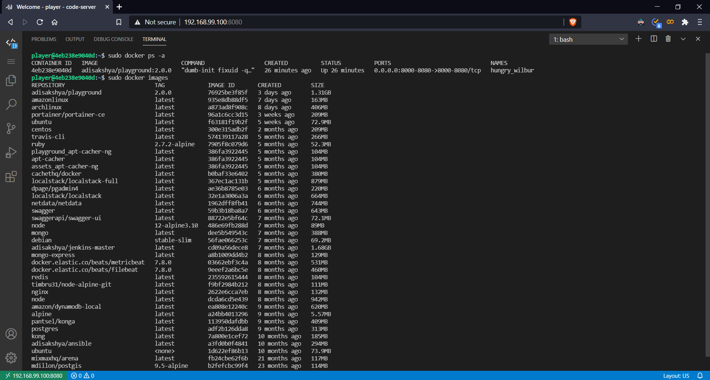

# Local Playground

- Setup your minimal customized local development environment.
- Preserve battery life when you're on the go.

## Getting Started

There are two ways to setup the local development environment which can be accessed using a Web IDE:

- Using the install script which automates the setup process.
    1. Install scripts are included for the following platforms:
        - Debian and Windows (WSL)
            ```
            curl -fsSl https://raw.githubusercontent.com/adisakshya/playground/master/local/shell/debian.sh | sh
            ```
        - Amazon-Linux
            ```
            curl -fsSl https://raw.githubusercontent.com/adisakshya/playground/master/local/shell/amazon-linux.sh | sh
            ```
    2. Feel free to contribute an install script for any other platform like CentOS, MacOS, Arch Linux etc, that would setup the local development environment in a single command.
- Using Docker [make sure you have docker installed]
    1. Pull the latest docker-image of playground from dockerhub or alternatively build the docker-image from source and then use ```docker run``` command to start playground container.
        ```
        # Pull the latest playground docker-image from dockerhub
        docker pull adisakshya/playground
        
        # Build the playground docker-image
        docker build -t adisakshya/playground -f local/docker/Dockerfile .
        
        # Run playground container
        docker run \
            -u $(id -u):$(id -g) \
            -v //var/run/docker.sock://var/run/docker.sock:rw \
            -p 8001-8080:8001-8080 \
            adisakshya/playground
        ```
    2. Using [portainer](https://www.portainer.io/)
        1. Pull the latest docker-image of portainer and playground:
        ```
        # Pull the latest portainer docker-image from dockerhub
        docker pull portainer/portainer-ce
        
        # Pull the latest playground docker-image from dockerhub
        docker pull playground
        ```
        2. Start portainer container, access the Web GUI on ```http://<DOCKER_HOST>:9000``` and connect to local docker, consider following [this guide](https://documentation.portainer.io/v2.0/deploy/ceinstalldocker) for reference. 
        3. Create and save a new custom application template using the docker-compose template file that can be found at ```local/docker/docker-compose.yml```.
        4. Now anytime you need a development environment deploy the application template from portainer in just one click.
        5. The playground web IDE will be accessible on ```http://<DOCKER_HOST>:8080```.

## Playground in action

Code from your laptop, PC or remote VM with a consistent development environment.

Welcome Screen             | Docker Access
:-------------------------:|:--------------------------:
   | 
